# 1.创建RTSManager蓝图框架文件

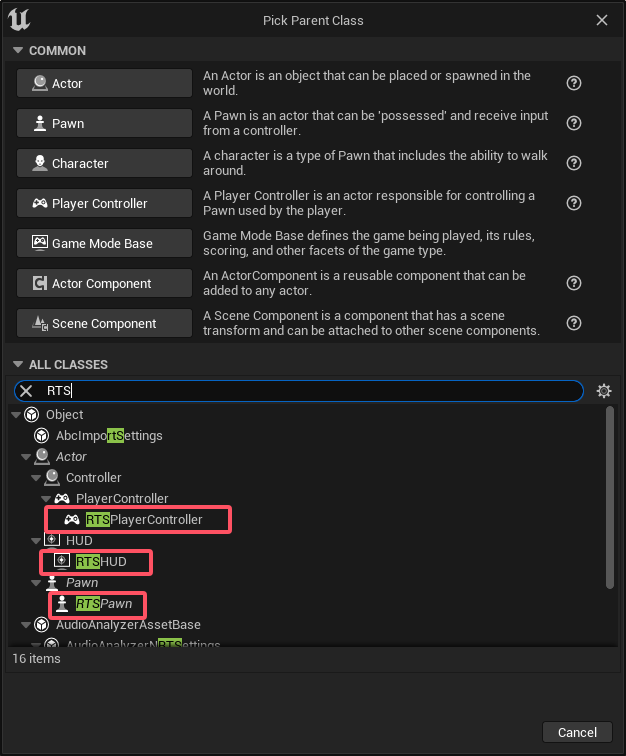

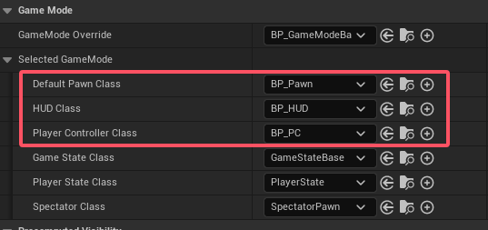

2.在PlayerController中对相关快捷键进行添加（使用增强输入文件）

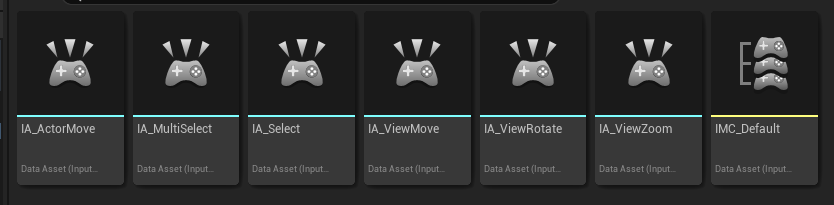

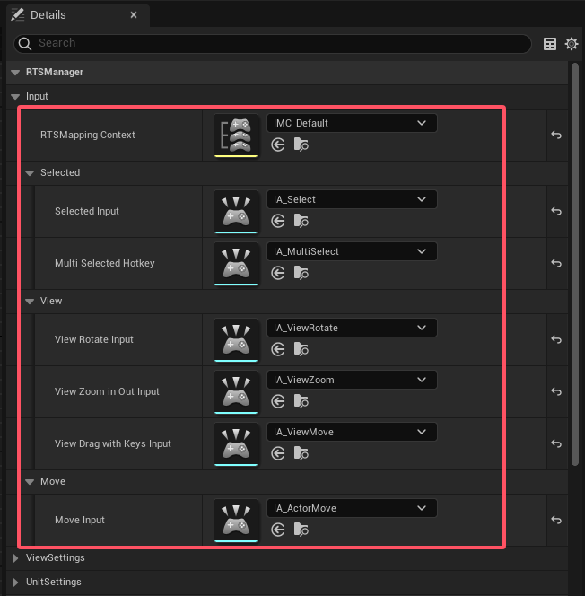

# 3.HUD中设置框选的类型和颜色

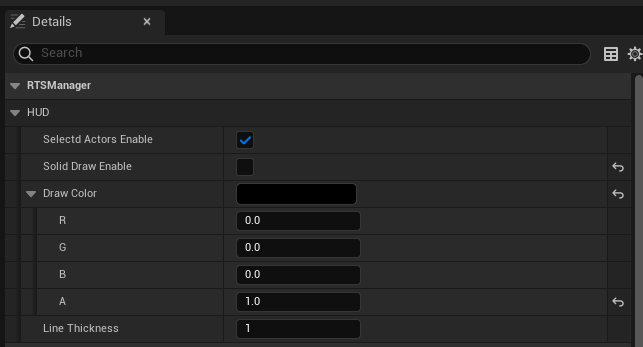

注意：DrawColor的Alpha值不能为0，否则无法看到框选形状

# 4.可以框选的单位必须添加组件SelectedActor

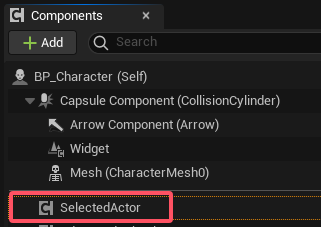

该组件有三个触发委托，符合条件进行触发

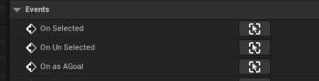

# 5.进行阵列移动的单位必须添加组件AdvancedBehavior

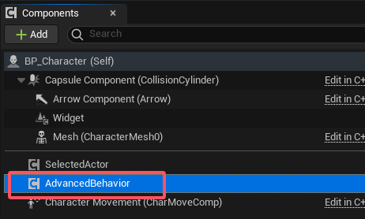

该组件有两个触发委托，符合条件进行触发

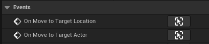

# 6.建造判断请继承JudgmentBuild类

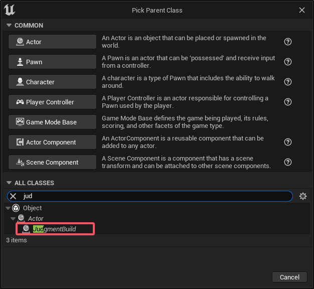

该类中判断的核心通过下面函数

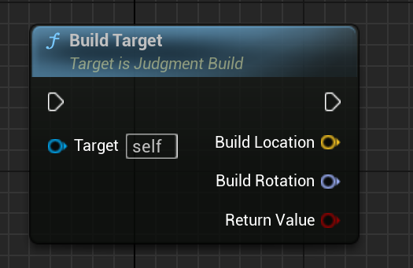

return Value的值如果为true，说明当前可以建造，返回可建造的坐标，以及当前的旋转值

# 注：更多函数可以在对应的类中右键搜索RTSManager

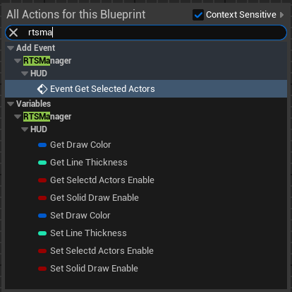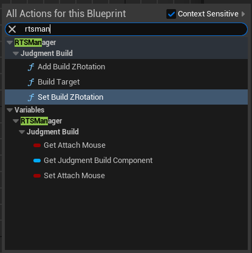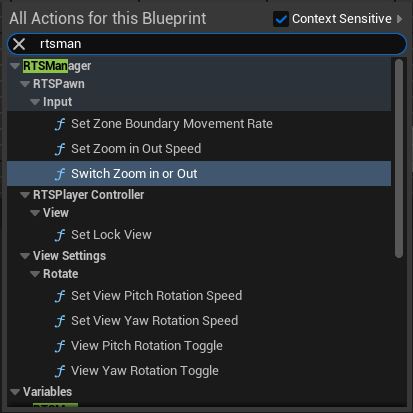

或参考项目示例